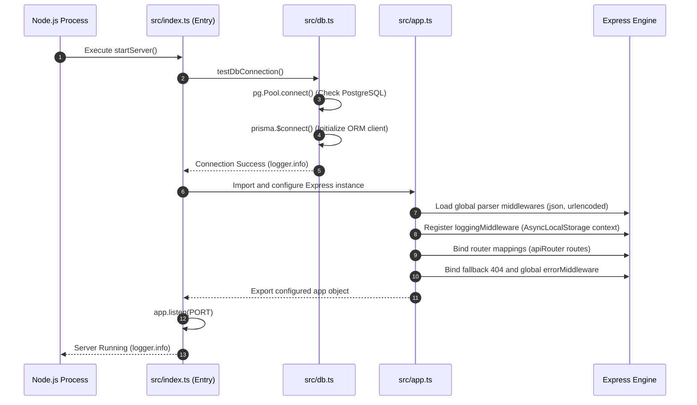
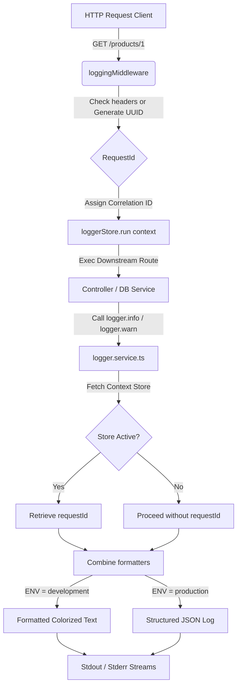
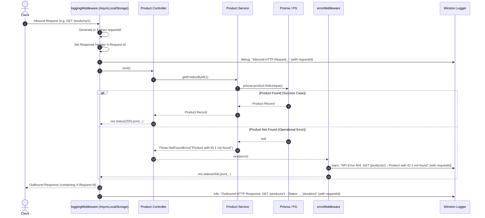

# Application Architecture Flows

This document details the main runtime flows of the backend application:
1. **Application Initialization Flow**
2. **Logger & Request Context Flow**
3. **API Request-Response Lifecycle Flow (with tracing and error handling)**

---

## 1. Application Initialization Flow

When the application boots up, it runs through connection checks and server configuration steps before listening to client traffic.

---

## 2. Logger & Request Context Flow

The logger system manages environment-based formatting and relies on Node.js's native `AsyncLocalStorage` to implicitly link logs to their triggering requests.

### Context Isolation
Using `AsyncLocalStorage` avoids having to pass a `req` or `requestId` parameter manually across the controller, database service, or helper libraries. Any log statement run within the asynchronous execution path initiated by the middleware automatically outputs the associated request context.

---

## 3. API Request-Response Lifecycle Flow

Below is the end-to-end lifecycle of an HTTP call, illustrating normal response execution, exception recovery, and tracing propagation:

