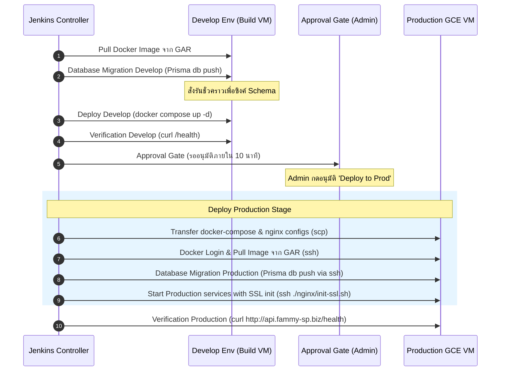
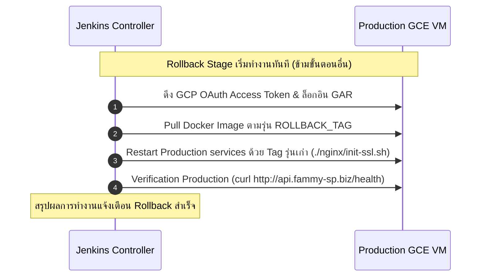

# Jenkins CI/CD Deployment Flow 🚀

เอกสารนี้สรุปขั้นตอนการทำงาน (Workflow) และสถาปัตยกรรม (Architecture) ของระบบ CI/CD สำหรับ Node.js Backend Application โดยใช้ **Jenkins**, **Docker**, **Google Cloud Artifact Registry (GAR)** และ **Docker Compose**

---

## 1. System Architecture Overview (ภาพรวมสถาปัตยกรรม)

ระบบ CI/CD นี้ขับเคลื่อนด้วย Jenkins ที่ทำงานบน Docker Container และเชื่อมต่อไปยัง Google Cloud Artifact Registry (GAR) สำหรับการ Build และ Deploy ขึ้น Production VM

```mermaid
graph TD
    %% Define components
    Dev[Developer / Git Push] -->|1. Commit & Push| GitHub[GitHub Repository]
    GitHub -->|2. Webhook / Trigger| Jenkins[Jenkins Controller]
    
    subgraph Build Server / Jenkins Environment
        Jenkins -->|3. Read Pipeline| JenkinsfileCI[Jenkinsfile.ci]
        Jenkins -->|8. Read Pipeline| JenkinsfileCD[Jenkinsfile.cd]
        
        JenkinsfileCI -->|4. Docker Build| DocBuild[Docker CLI]
        DocBuild -->|5. Push Image| GAR[Google Artifact Registry <br> asia-southeast3-docker.pkg.dev]
        
        %% Local / Dev environment deploy
        JenkinsfileCD -->|6. Run Migrations & Deploy Dev| DevEnv[Develop Environment <br> Local Docker Compose]
    end

    subgraph Production Environment (GCE VM)
        GAR -->|11. Pull Image via SSH| ProdVM[Production GCE VM <br> IP: 34.143.249.238]
        JenkinsfileCD -->|9. SCP configs & SSH Commands| ProdVM
        ProdVM -->|10. DB Migration| ProdDB[(Prisma PostgreSQL)]
        ProdVM -->|12. Run Application| ProdApp[Backend Container <br> port 8080]
        ProdVM -->|13. SSL / Reverse Proxy| Nginx[Nginx Container <br> API Domain: api.fammy-sp.biz]
    end

    %% Manual Approval Link
    JenkinsfileCD -->|7. Manual Approval| Approval{Approval Gate <br> Timeout 10m}
    Approval -->|Approved| ProdVM
```

---

## 2. CI/CD Pipeline Flows (ขั้นตอนการทำงานโดยละเอียด)

ระบบแบ่ง Pipeline ออกเป็น 2 ส่วนหลักคือ **CI Pipeline** และ **CD Pipeline**

### 2.1 Continuous Integration (CI) — `Jenkinsfile.ci`

ทำหน้าที่สร้าง Docker Image เมื่อมีการอัปเดตโค้ดและส่งขึ้นไปเก็บไว้บน Google Cloud Artifact Registry (GAR)

#### ลำดับขั้นตอนการทำงาน:
1. **Trigger**: เริ่มทำงานเมื่อตรวจพบการเปลี่ยนแปลงบน Git Repository
2. **Build Docker Image**:
   - เข้าไปยังโฟลเดอร์ [backend](file:///Users/sirichaiprasopphon/Documents/2026-practice/node-learn-101/backend)
   - Build Image และกำหนด Tag ตามเลขการรันงานของ Jenkins (`${BUILD_NUMBER}`) และ Tag `latest`
     ```bash
     docker build -t asia-southeast3-docker.pkg.dev/.../express-app:${BUILD_NUMBER} .
     docker tag asia-southeast3-docker.pkg.dev/.../express-app:${BUILD_NUMBER} asia-southeast3-docker.pkg.dev/.../express-app:latest
     ```
3. **Push to Registry**:
   - ดึง Access Token จาก GCE VM Metadata Server:
     ```bash
     curl -s -H 'Metadata-Flavor: Google' http://metadata.google.internal/computeMetadata/v1/instance/service-accounts/default/token
     ```
   - เข้าสู่ระบบ Docker Registry ของ GCP โดยใช้ Username `oauth2accesstoken`
   - Push ทั้งสอง Tag ขึ้นไปยัง Google Cloud Artifact Registry (GAR)
4. **Post Clean Up**:
   - สั่ง `docker image prune -f` เพื่อลบ Dangling images (Image ที่ไม่มี Tag) บนตัวเครื่อง Build เพื่อประหยัดพื้นที่ฮาร์ดดิสก์

---

### 2.2 Continuous Delivery (CD) — `Jenkinsfile.cd`

ทำหน้าที่นำ Docker Image ที่ผ่านการ Build แล้วมา Deploy ลงใน Develop environment (Local) และ Production Environment (GCE VM) โดยระบบรองรับการ Deploy ปกติ และระบบ Rollback เมื่อมีปัญหา

#### ตัวแปรพารามิเตอร์ของ Pipeline:
* `IMAGE_TAG` (Default: `latest`): กำหนด Tag ของ Docker Image ที่ต้องการ Deploy
* `ROLLBACK` (Default: `false`): หากเปิดใช้งาน (Check) จะข้ามขั้นตอนการ Deploy ปกติ และเข้าสู่ขั้นตอนการ Rollback ทันที
* `ROLLBACK_TAG` (Default: `latest`): กำหนด Tag ของ Docker Image ที่ต้องการ Rollback กลับไปใช้งาน

---

## 3. Flow การทำงานของ CD Pipeline (แบ่งตามโหมดการใช้งาน)

### 3.1 Normal Deployment Flow (`ROLLBACK` = `false`)

เมื่อการทำงานเป็นการ Deploy ปกติ Pipeline จะดำเนินการตามลำดับขั้นดังนี้:



#### รายละเอียดในแต่ละขั้นตอน (Normal Deploy):

1. **Pull Image**: ล็อกอินเข้า GAR และดาวน์โหลด Image รุ่นที่ระบุลงมาบนเครื่อง Build Server
2. **Database Migration Develop**: ซิงค์ฐานข้อมูลฝั่ง Develop ด้วยการรัน Prisma Command บน Container ชั่วคราว:
   ```bash
   IMAGE_TAG=${IMAGE_TAG} docker compose run --rm backend npx prisma db push --accept-data-loss
   ```
3. **Deploy Develop**: อัปเดตและสั่งรันระบบใน Develop environment (Local) ด้วย Docker Compose:
   ```bash
   IMAGE_TAG=${IMAGE_TAG} docker compose up -d
   ```
4. **Verification Develop**: รันเช็คสถานะการเข้าถึงของแอปพลิเคชัน (Health Check) หลังรอให้ระบบเริ่มทำงาน 5 วินาที:
   ```bash
   curl -fsS http://localhost:8080/health
   ```
5. **Approval Gate**: Pipeline จะหยุดรอให้ Admin เข้ามาตรวจสอบและกดอนุมัติ (มีเวลาจำกัด 10 นาที) หากอนุมัติจะเข้าสู่ขั้นตอนถัดไป
6. **Deploy Production**: 
   - เชื่อมต่อผ่าน SSH Agent โดยใช้ Credential SSH Key ที่ตั้งไว้ใน Jenkins (`gcp-prod-ssh-key`)
   - ส่งไฟล์คอนฟิกต่าง ๆ (เช่น `docker-compose.yml`, `docker-compose.prod.yml`, `nginx`) ไปยัง Production VM ผ่าน `scp`
   - สั่งรันคำสั่งบน Production VM ผ่าน `ssh` เพื่อทำการดึง Image, ซิงค์ฐานข้อมูล (Prisma db push), และสั่งรันบริการพร้อมตั้งค่าใบรับรอง SSL:
     ```bash
     ./nginx/init-ssl.sh
     ```
7. **Verification Production**: รอให้ระบบทำงาน 10 วินาที แล้วทำการตรวจสอบ Health Check ไปที่โดเมนจริง:
   ```bash
   curl -fsSL http://api.fammy-sp.biz/health
   ```

---

### 3.2 Rollback Flow (`ROLLBACK` = `true`)

หากผู้ใช้ตรวจพบว่าแอปพลิเคชันมีปัญหาหลังจากทำงาน และต้องการสั่ง Rollback ด่วน สามารถสั่งรัน Pipeline ใหม่โดยเลือกติ๊กถูกที่ช่อง `ROLLBACK` และระบุ `ROLLBACK_TAG` ที่ต้องการย้อนกลับไปใช้ โดยจะข้ามขั้นตอนอื่น ๆ ทั้งหมดและมุ่งตรงไปทำขั้นตอนย้อนกลับทันที



#### รายละเอียดขั้นตอน (Rollback):
1. **Rollback Stage**: ทำงานผ่าน SSH Agent ไปยัง Production GCE VM
2. **Pull image (Rollback version)**: สั่งให้เครื่อง Production ทำการดึง Image ตาม Tag ของเวอร์ชันเดิมที่ต้องการย้อนกลับ (`ROLLBACK_TAG`) จาก GAR
3. **Restart with Rollback Version**: รัน Shell Script บนเซิร์ฟเวอร์ปลายทางเพื่อรันแอปพลิเคชันด้วย Tag ที่กำหนดใหม่:
   ```bash
   export IMAGE_TAG='${params.ROLLBACK_TAG}'
   ./nginx/init-ssl.sh
   ```
4. **Verification**: ตรวจสอบ API Health Check ของโดเมน Production อีกครั้งเพื่อให้แน่ใจว่าการย้อนกลับเวอร์ชันทำได้สำเร็จลุล่วง
5. **Post cleanup & Success status**: ล้างไฟล์ขยะและแจ้งเตือนเวอร์ชันที่ถูก Rollback กลับไปใช้ในระบบเรียบร้อยแล้ว

---

## 4. สรุปคำสั่งสำคัญและการบำรุงรักษา

### 4.1 การจัดการ Jenkins (ภายในเครื่อง/Local)
* **เริ่มระบบ Jenkins**: `docker compose up -d` (รันภายในไดเรกทอรี `pipeline/jenskins`)
* **ดู Logs**: `docker compose logs -f`
* **หยุดระบบชั่วคราว**: `docker compose down`
* **ล้างข้อมูลทั้งหมด**: `docker compose down -v` (ล้าง Volume รวมถึง Job และ Configuration ทั้งหมด)

### 4.2 เคล็ดลับการบำรุงรักษาพื้นที่ (Storage Cleanup)
เนื่องจากการ Build / Pull / Push บน Docker ทุกรอบจะสะสมเนื้อที่ดิสก์เพิ่มขึ้น Pipeline จึงมีคำสั่งเคลียร์ Image ในส่วน `post` เสมอ:
```groovy
post {
  always {
    sh "docker image prune -f"
  }
}
```
*ระบบจะเรียก `docker image prune -f` เพื่อล้าง Dangling images ทิ้งทันทีเมื่อ Pipeline รันเสร็จสิ้นไม่ว่าจะสำเร็จหรือล้มเหลว*
